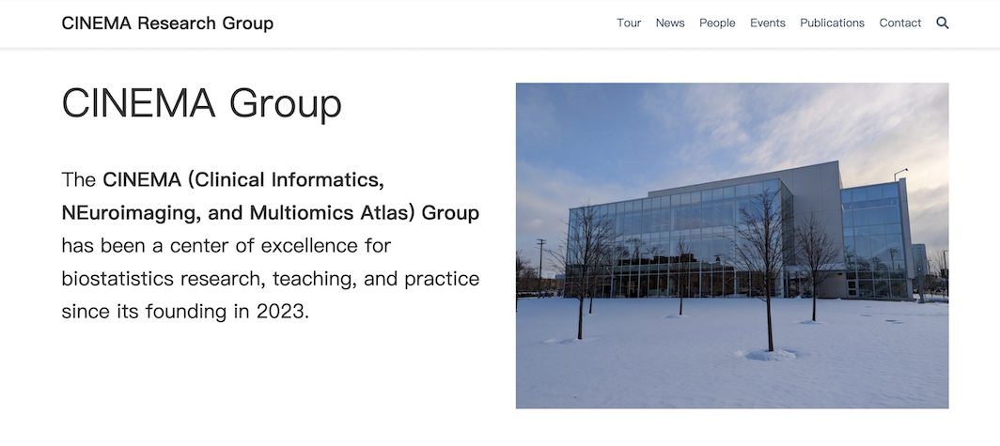

# Welcome to the CINEMA Group

The CINEMA Group is a newly established research group focused on the intersection of clinical informatics, neuroimaging, and multiomics. Our goal is to develop innovative solutions for understanding human health and disease using advanced statistical and computational methods.

The group is led by three highly accomplished researchers:

- Associate Professor Ming Wang
- Associate Professor Lijun Zhang
- Assistant Professor Liangliang Zhang

Together, they bring a wealth of expertise to the group and are dedicated to advancing the field of quantitative health.

Stay tuned for updates on our latest research projects and collaborations. We are excited to share our groundbreaking work with the scientific community.
