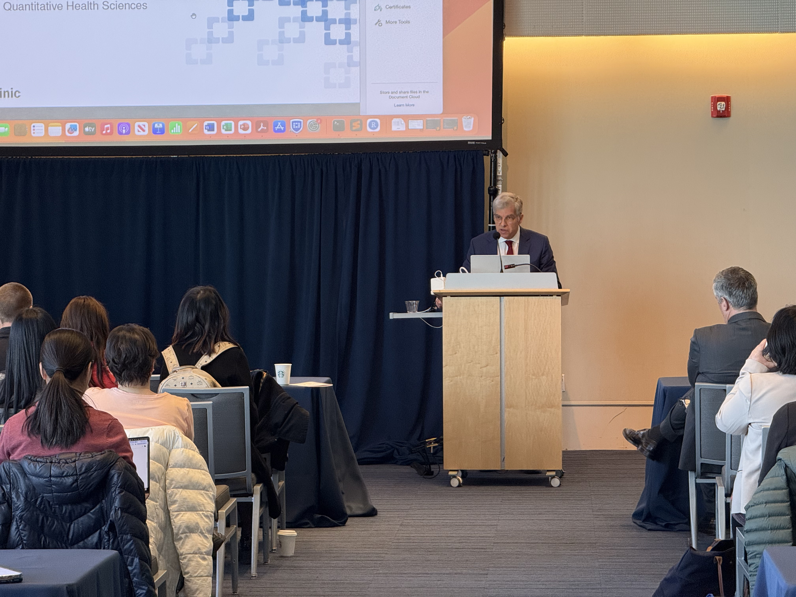
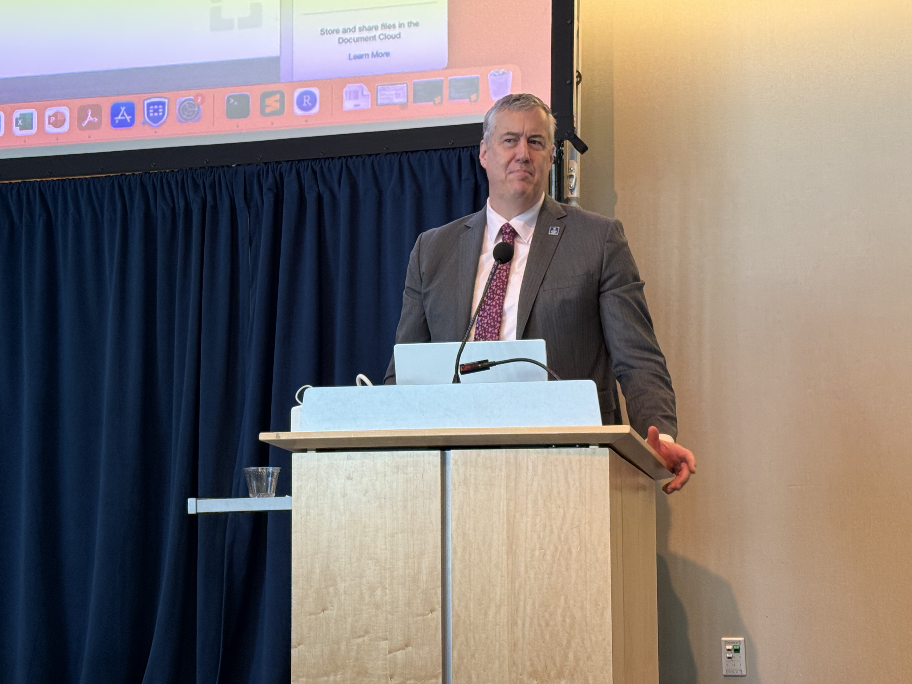
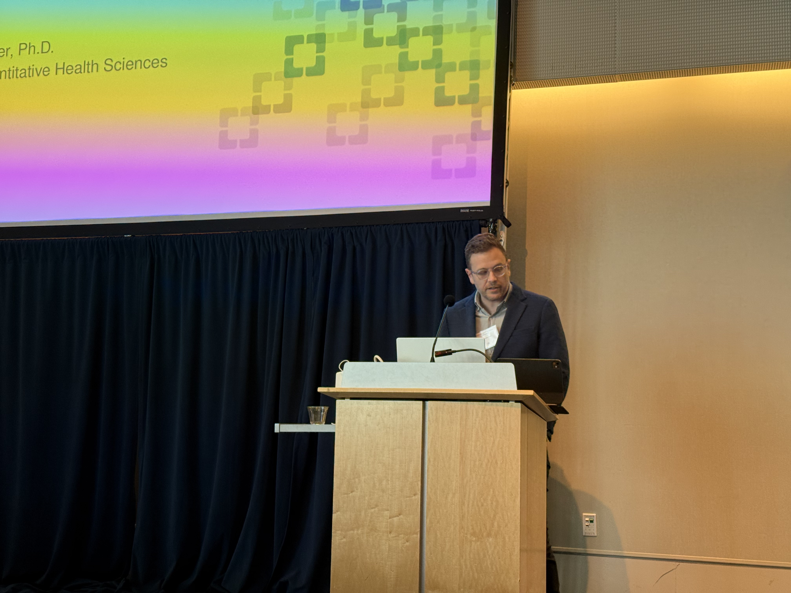
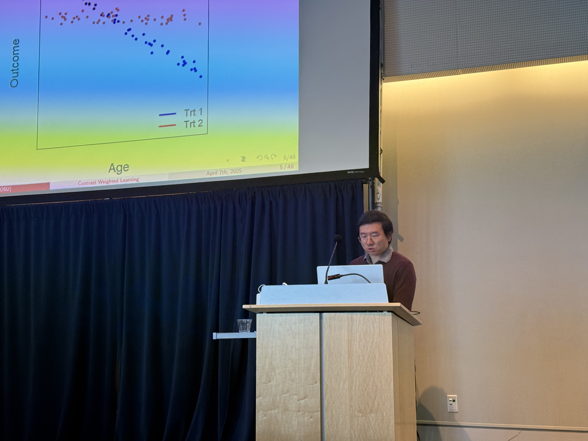
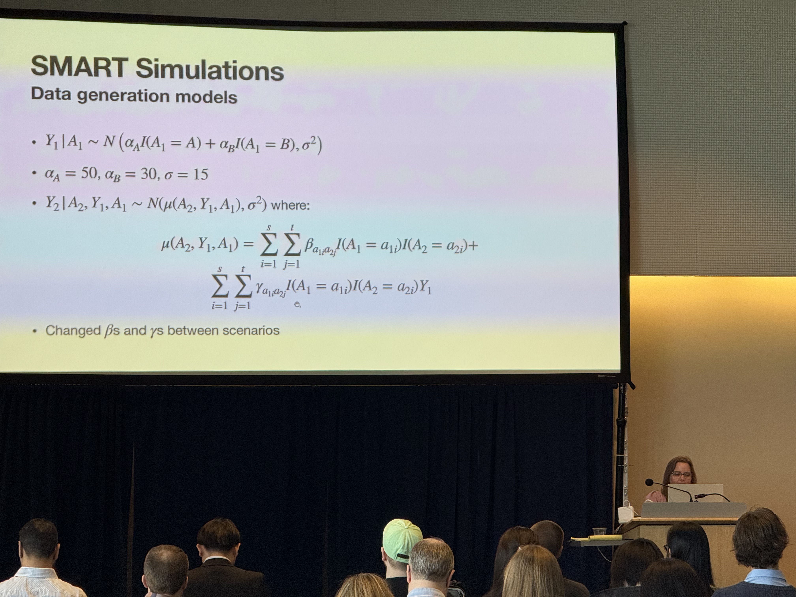
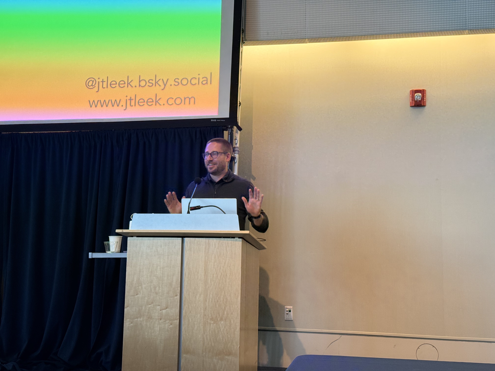

Liangliang and Ming led the 2025 Joint Symposium.

<!--more-->

The 2025 Joint Biostatistics Symposium was held on April 7 at Case Western Reserve University's Tinkham Veale University Center, drawing over **170 registrants** from across the region. Despite the challenges in national research funding, the event brought together **more than 120 in-person attendees**, with additional guests dropping in to engage with the vibrant biostatistics community.

This annual event is a collaborative effort between **Case Western Reserve University, The Ohio State University, and Cleveland Clinic**, designed to foster collaboration, showcase impactful biostatistical research, and support the next generation of scientists. This year's symposium also attracted additional participants from surrounding institutions, including the University of Akron, Kent State University, and Cleveland State University.

Despite the broader national challenges surrounding research funding, we are deeply grateful for the generous support from the Dean's Office (\$5000) and the Case Comprehensive Cancer Center (\$1000), which has made this event possible. This year, we're also excited to introduce a student poster competition for the first time, supported by the Department of Population and Quantitative Health Sciences (\$500), whose contribution enabled this new addition.

In his opening remarks, **Dr. Gary Schwartz**, Director of the Case Comprehensive Cancer Center, highlighted the center's top-tier NCI designation and underscored the vital role of data science, biostatistics, and collaboration in advancing cancer research. Following him, **Dr. J. Michael Oakes**, Senior Vice President for Research and Technology Management at CWRU, shared his vision for future innovation and highlighted key initiatives including the forthcoming Interdisciplinary Science and Engineering Building and NSF-supported regional partnerships.

The scientific program featured a diverse lineup of speakers including:

-   **Dr. Christopher Boyer** (Cleveland Clinic), who shared insights from his work in communicable disease dynamics and clinical biostatistics.

    

-   **Dr. Andy Ni** (Ohio State University), who discussed methodological advances in individualized treatment regimes and survival analysis.

    

-   **Dr. Holly Hartman** (Case Western Reserve), who presented on clinical trial design and addressing disparities in oncology outcomes.

    

This year marked the debut of the **Student Poster Competition**, supported by the Department of Population and Quantitative Health Sciences. With **21 eligible posters** from undergraduate, master's, doctoral, and postdoctoral researchers, the session showcased innovative work across a range of biostatistical applications. **Dr. Jonathan Haines**, Department Chair, presented awards to the top contributors and praised the high level of scholarly excellence and engagement.

Attendees enjoyed **complimentary lunch and refreshments throughout the day**, and the poster session provided a lively space for discussion, feedback, and collaboration.

**Dean Stan Gerson** underscored the critical importance of biostatistics in driving progress in medical research and had the distinguished honor of introducing the keynote speaker.The symposium concluded with a keynote lecture from **Dr. Jeff Leek**, Vice President and Chief Data Officer at Fred Hutchinson Cancer Center, and recipient of the prestigious COPSS Presidents' Award. His talk, filled with insight and humor, emphasized the power of data science to bridge research and public impact. To honor his contribution, the organizing committee presented Dr. Leek with a commemorative plaque.

We were delighted to host our keynote speaker at the historic Glidden House, located just a short three-minute walk from the Tinkham Veale University Center. Our evening on April 6 began with a delightful Chinese dinner at **Lao Sze Chuan** in Beachwood, setting the tone for the warm collegiality of the event. On April 7, following a day of engaging talks and poster presentations, we gathered for a memorable post-symposium celebration at **Delmonico's Steakhouse** in Independence. It was a fantastic opportunity to relax, reflect, and connect with colleagues. I'm pleased to share a photo we took together at Delmonico's---a snapshot of great company, lively conversation, and a truly enjoyable evening.

A heartfelt thank-you goes to the **steering committee, local organizing committee, and all volunteers** who made this event possible. Their efforts transformed this symposium from an idea into a dynamic forum for scientific exchange.

We look forward to welcoming you again next year for the 2026 Joint Biostatistics Symposium!

**Supporting information**

**Link to program book:** <https://bioscinema.github.io/biostatsymposium/programbook/>

**Poster Award Results:**

Five outstanding poster presentations were selected for recognition. The top three awardees, listed in bold and ranked in order, each received a certificate and a gift card of \$100, \$80, and \$60, respectively. The remaining two received Excellence Awards, accompanied by certificates, to acknowledge and encourage their achievements.

**First Place Award:**

**Zihan Zhu, Postdoc, Case Western Reserve University**

**Title: Enhanced Pattern Recognition and Biomarker Identification through Beta Diversity Analysis in Microbiome Data**

**Second Place Award:**

**Rajkumar Dhar, Postdoc, Cleveland Clinics**

**Title: Automated QT Detection in ECG Signals Using Deep Learning**

**Third Place Award:**

**Mengxuan Li, PhD, Case Western Reserve University**

**Title: Cell Type-Specific contributions of PRS of 71 complex traits**

**Excellence Awards:**

Lingpeng Shan, PhD, Ohio State University

Title: Bayesian Variable Selection for Joint Models of Heterogeneous Longitudinal Variables and a Binary Outcome

Raghav Awasthi, Postdoc, Case Western Reserve University

Title: Unsupervised evaluation of pre-trained DNA language model embeddings 
